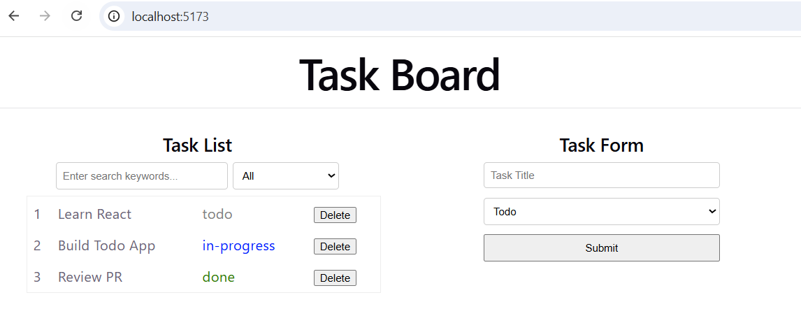

# Task Board
A simple Task Board using **React** + **TypeScript** + **Vite**

## Functionalities
1. Add Task
- Add new tasks through a form with:
  - Title: (Required)
  - Status: todo, in-progress, or done

2. Task List
- View: Shows title and status.
- Delete: Remove specific tasks from the list.

3. Filter & Search
- Search: Filter tasks by title (partial matching supported).
- Filter: View tasks by status (all, todo, in-progress, or done).